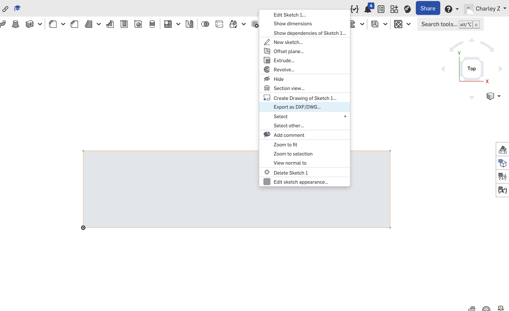
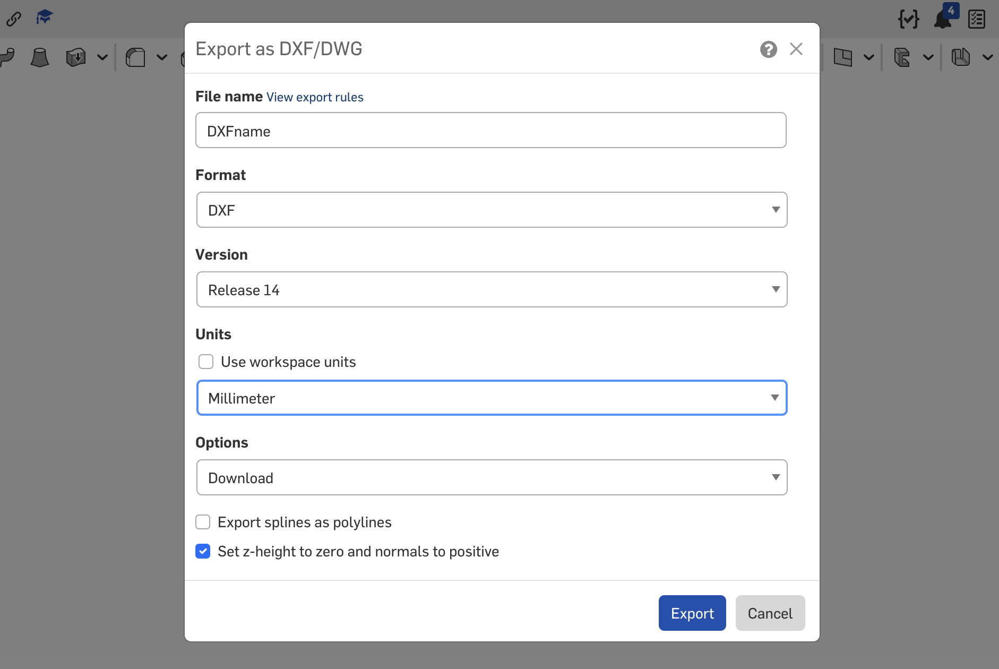
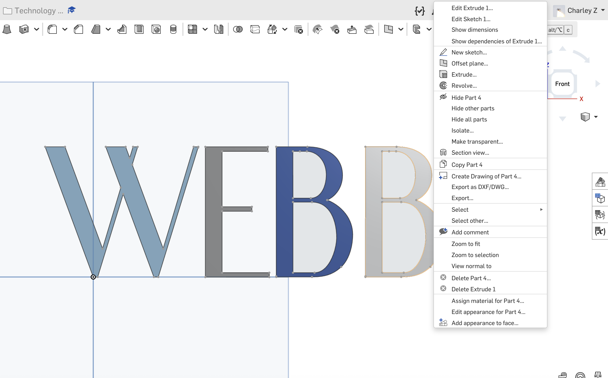
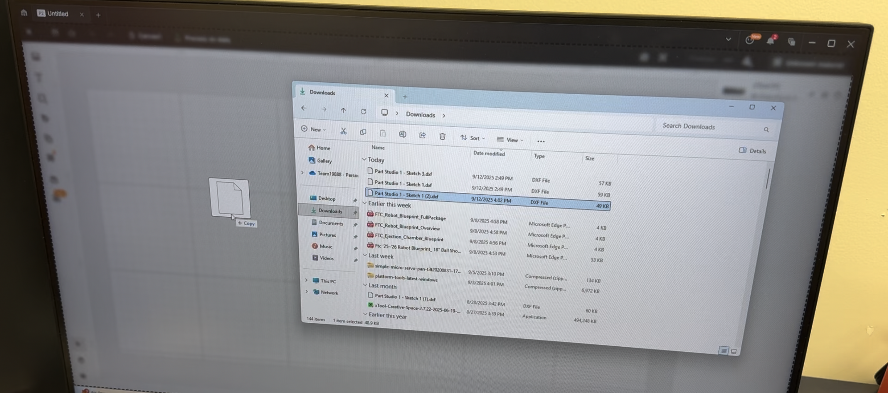
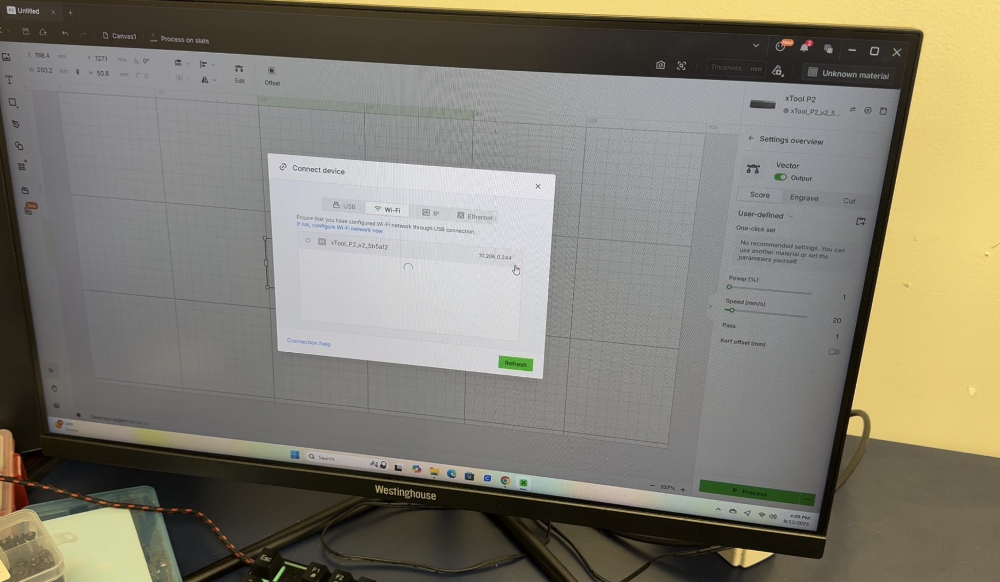
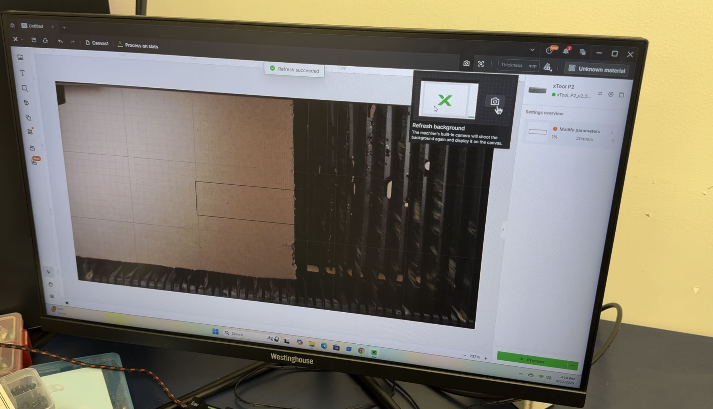
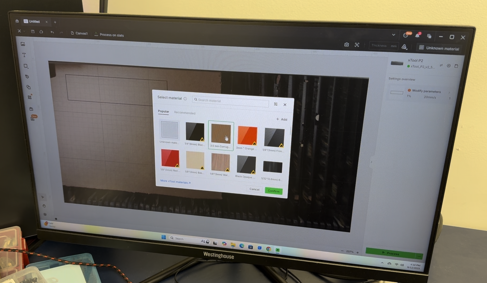
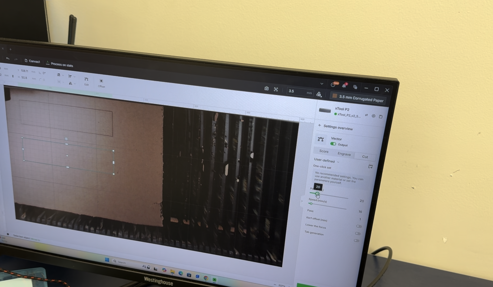
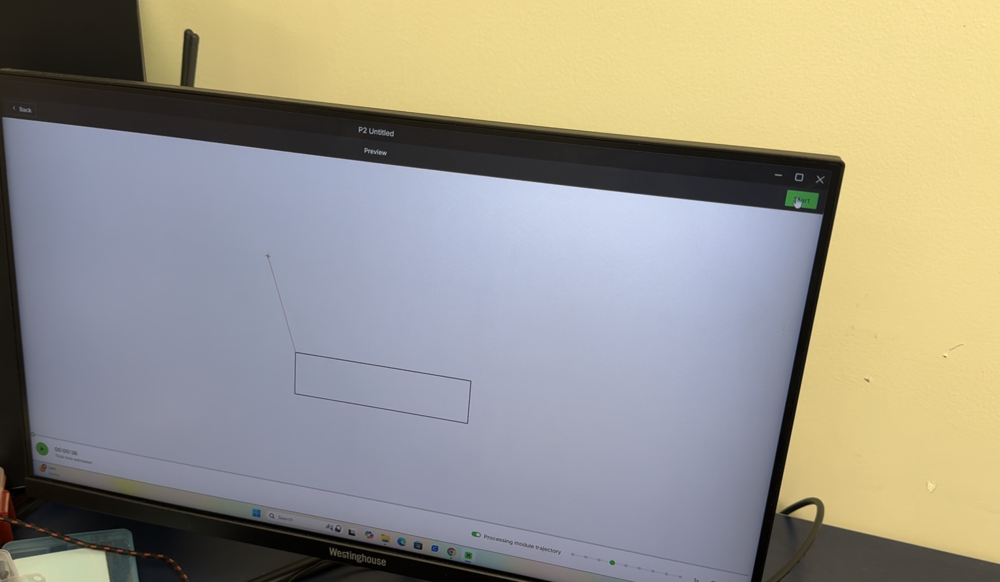

# Laser Cutters

Laser cutters use computer numeric control (CNC) technology to accurately position a high-intensity laser over a sheet material. This allows precise engraving or cutting of the hseet material by light. Laser cutters are typically used for projects that require high precision but made of flat, 2D components. Unlike 3D printers, laser cutters cannot accomplish additive manufacturing, as they subtract material from a flat stock. 

Laser cutters are therefore highly recommended for parts that are flat-sheet based. 3D parts can also be designed to be made form individual flat components, which allows certain shapes to utilize the laser cutter as well. This is due to its efficiency. They are far more rapid than a 3D printer, as all material stock already exists (instead of having to melt them into place). This means the laser cutter is extremely useful in project cycles requiring rapid prototyping. Laser cutters can also be used for precision art and edge trimming, with a far smoother surface finish and an accuracy down to 1 thou on low-reflectivity materials (in the case of the P2S).

At Webb, there are two types of laser cutters. In the robotics room, there is an XTool P2S, which has a 55W CO2 based laser. In Studio A of the library innovation lab, there is a Creality Falcon 2 Pro, which is a 40W semiconductor diode laser. This tutorial will be going through the usage of these laser cutters and giving an example, a part from robotics, which can be efficiently manufactured via a laser cutter.

## Preparing for the Laser Cutter
First, the design of the desired part is completed in a CAD software. 

As laser cutters work on 2D planar surfaces, they accept 2D design to calculate GCode positioning. For this section, we will be using the CAD program Onshape (found at https://onshape.com/), and use the DXF file format. Other file vector-based formats such as SVG files are accepted as well. However, they follow a similar process, but could involve additional software (eg. Adobe Illustrator).

A simple, 2D sketch can be exported using the "Export as DXF" button found when right-clicking a bounded area of the sketch. This exports the continugous face, that the mouse is currently part of.

For a part of a more complex object, such as a CAD model that involves thickness, right click the desired flat face on the 3D object. The face cannot be curved as laser cutters USUALLY work in a planar fashion. The XTool P2S is an exception to this rule; however, even with the 3D engraving feature, the machine does not process 3D files directly and must be converted into a greyscale image for contour mapping.

**IMPORTANT:** whenever using the XTool P2S or the Creality Falcon 2 Pro, the DXF **MUST** be exported in units of **MILLIMETERS**. 

This is the default working unit for both lightburn and XTool Creative Space, the software used to process the DXF file into instructions to the laser cutter. Unless you have manually changed the unit in the software to something else, assume default settings and use millimeters. The unit can be selected in a pop up menu in Onshape when confirming the DXF file export.

## Using the XTool P2S
Observe the XTool P2S. The laser cutter is comprised of a flat, rectangular cutter body, a filter module on the side and a long and thin vent wall panel used to block out the fumes, connected to the filter and laser cutter via an air pipe. 
The first step is to turn on the filter module, with the switch located on the front side, then turn the dial on the right side of the module to maximum. Open the window of the robotics lab, then go outside. From the outside, pass the entire white wall vent panel through the window. From the outside, the black sliding window frame has two distinct slots, with notches separating them. Identify the second slot, which is the one furthest towards the indoors. Raise the wall panel and slide the top of the panel into the second slot, making sure the vent side faces out and the duct side faces in. Slide the bottom of the panel into the same slot, then close the window. The window should securely squeeze the wall panel into the wall, with the sponse seal contacting the window frame the entire way up. The setup is now complete.

Identify the power switch on the back right corner of the laser cutter and turn the laser cutter on. The screen and round button on the top of the laser cutter should light up. Observe that the laser cutter auto homes its cutting head. Go back to the computer and start up a new project in XTool Creative Space, the software used to send designs to the XTool P2S. Open up a new project. This should lead to an interface with a white grid in the middle, a toolbar on the left and on top, and some options on the right. 

Import the DXF file by dragging the DXF file directly into the grid space. A black outline of the DXF should appear.

Connect the computer to the wifi "Webb", as this will allow wireless connectivity to the laser cutter. Locate the connection button on the top right, shaped like two arrows facing opposite directions. Clicking the connect button should show a menu. If the laser cutter is already shown, press the Connect button on the right. If it is not shown, click the connect device text in the bottom, select Wi-Fi mode and then find the laser cutter in the list of wifi devices. Alternatively, use a USB-C data cable, plugging one end into the computer and another end into the corresponding port on the left side of the laser cutter.

Once the laser cutter is connected, an image of the laser cutter's camera should automatically appear on the screen. The option to refresh the image is located on the icon shaped like a camera with a refresh symbol inside.

Place a piece of stock material in the laser cutter, whether that be acrylic, wood (MDF / eucaboard), cardboard, corrugated plastic or others. Note that cutting polycarbonate is currently not supported by the filters. Remember the type of material and thickness of material. Refresh the camera in the XTool Creative Space. Go to the top right of the screen, and click on the text "Unknown material". Select the desired material and thickness from the menu. In this case, the material is 3.5mm thick cardboard, which is listed as corrugated paper.

Then, drag the DXF file into the center grid area, where the camera image overlay now is. Place this over the desired (uncut) region of the stock material according to the imagery from the camera. The DXF file may also be adjusted by groups. By right-clicking, text with the same properties can be grouped together, which helps make selecting modes for each step more efficient.

After placing the DXF in its desired spot and using the measurement tool (found in the left menubar) to verify its dimensions, use the mode selector in the panel on the right to select either score, engrave or cut, depending on the nature of the project. Different groups of geometries can be assigned to different operations. After each operation is selected, set a laser power and head movement speed. 

The higher the power, the more intense the cut, but could result in elevated fire risks. The faster the speed, the more faster the cut completes, but too much speed could result in the laser not having enough time to burn through material. The XTool provides a grid which visualizes what each material results in for a certain range of presents of powers and speeds. A setting can be selected in the preset diagram by clicking one of the result options; a custom setting can be set using the sliders as well.

Once this is confirmed, click the green process button on the bottom right, and preview the path of the laser. Make sure that all text that are bounded internally to another shape is cut first before the outside is cut. Once that is good, click the green send button on the top right.

Go over to the laser cutter and press the large start button. Remember to stay nearby at all times during the cut!

## Using the Falcon 2 Pro

The Creality Falcon 2 Pro is located in the library innovation lab. This machine has a visible light laser, so it has a built in crimson lid to block out the laser light. You should get a pair of laser glasses as well. This laser cutter also has a cutter and a filter, although the filter currently vents indoors. Therefore, it is not recommended to cut any plastic due to the ventilation situation.

Find the power switch on the right side of the control panel of the laser cutter, and on the side of the ventilation filter. Turn the device on. 

On a laptop, install the software Lightburn (https://lightburnsoftware.com/), which will be used to interface with the laser cutter. Once installed, lightburn should show a grid in the middle, various tools in a toolbar on the top and on the left, and some options on the right. We already have a DXF file in Onshape, so we will not be using the illustration tools inside lightburn. Plug in the laptop with Lightburn to the laser cutter using a USB-C cable.

To connect lightburn to the Falcon 2 Pro, go to the devices page in lightburn, and click find my laser. If the configuration has already been set up the laser should appear. If not, click the import button. Locate the SD card on which the laser cutter's profile is stored in an .lbdev file format. Once this is imported, the Falcon 2 Pro should appear on the list of laser cutters. Select the laser cutter and press ok.

On the bottom right of lightburn next to the devices button, select the correct COM port on which the laptop is interfacing with the laser cutter, where the USB-C cable is connected. Then, restart the Falcon 2 Pro. In the setings dialog, enable mm/min as the working unit, and also turn on the laser fire button. Further, a USB camera inside the laser cutter can be enabled by plugging another USB-C cable to a port on the right side of the top hood. This camera can be selected from the dropdown in the camera control menu. THe camera mujst be calibrated by a small wooden block with a pattern of holes. The software will demonstrate where to place the block.

We can now import the design. This can be found in the File > Import menu, selecting the desired DXF file. After importing, check the scale of the design is correct. Power and speed settings can be adjusted according to the material properties on the right side menu. The laser head can also be moved for a visualization before the laser is actually fired to cut or engrave.

Finally, the laser needs to be focused. There are level focusing blocks which have a note on them indicating the corresponding material thickness. Select the correct focus block and place it under the laser module. Adjust the module height using the z-axis thumb screws until the module rests on the focus block. Tighten back the screws, remove the block, and the laser should be focused. You can now begin cutting the DXF file.

Example Project:
Pocketing a plate
